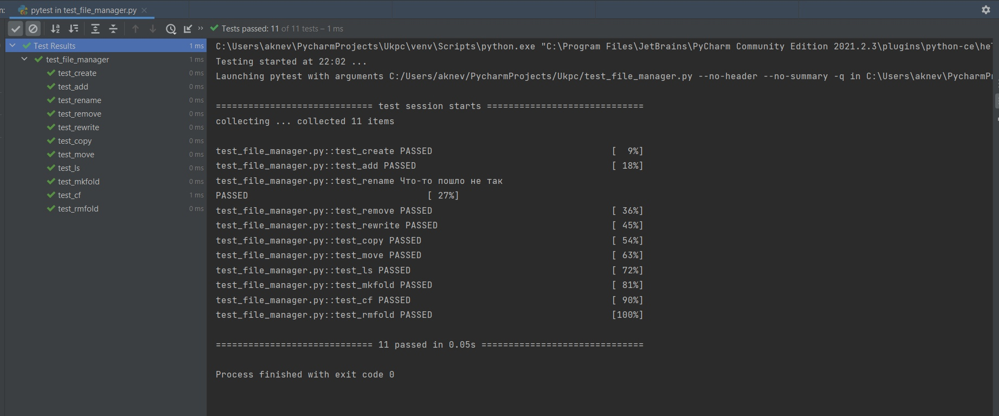

# Тестирование файлового менеджера

Был создпн отдельный файловый менеджер, который способен распозновать и реагировать на простейшие команды(Добавление файла, удаление файла, перемещение файла и т.д.).
---
Файл с менеджером : [file_manager](./file_manager.py).
Файл с тестированием: [test_file_manager](./test_file_manager.py).
Скриншот результатов тестирования через PyTest.

