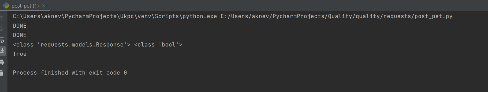
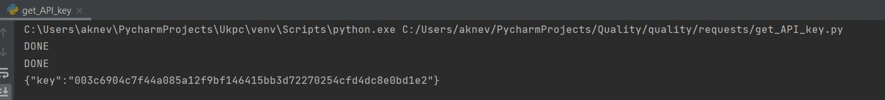
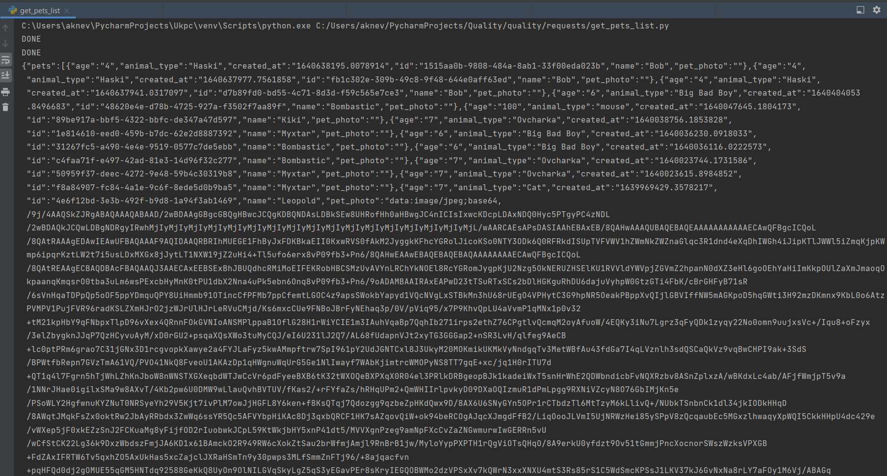
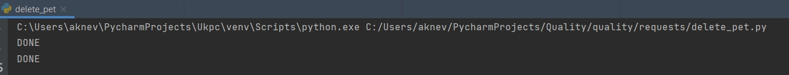
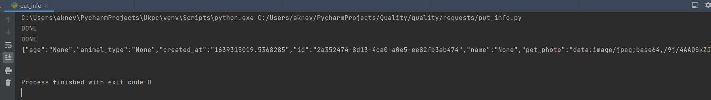
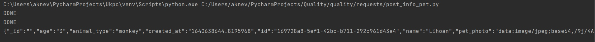
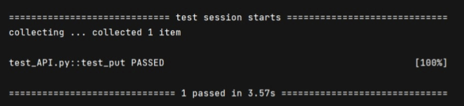

# Задание 3. Работы функций API.

С заданного сайта находим нужные запросы. Все 7 данных запросов реализованы и работают исправно.
---

Загрузка данных питомца без фотографии.(post)

Получение API.(get)

Получение списка питомцев.(get)

Удаление питомца из списка.(delete)

Добавление новой информации.(put)

Добавление нового питомца.(post)

Работа самого тестирования.

